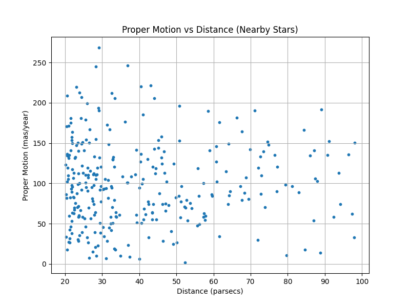

*Scatter plot of proper motion vs distance for nearby stars.*
# Gaia_Nearby_Stars_Project
Python workflow analyzing nearby stars (Gaia-style dataset)
# Gaia Nearby Stars Project

## About this Project
Hi! This is my project where I analyze nearby stars using a sample dataset that is similar to the real data from the ESA Gaia mission.  
I calculated how far the stars are and how fast they are moving, then made a scatter plot to show the relationship between distance and motion.  
Even though the dataset is made for practice, the same code can work with real Gaia data.

## What I Learned
- How to use Python and pandas for data analysis  
- How to make plots with matplotlib  
- How astronomers calculate distances and motions of stars  

## Dataset
The dataset I used has these columns:
- **DistanceMeasurement** – the parallax (distance measurement) in milliarcseconds  
- **MotionLeftRight** – motion along the sky in right/left direction (mas/year)  
- **MotionUpDown** – motion along the sky in up/down direction (mas/year)  

> Note: This is sample data for learning, not the real Gaia dataset lol, but I worked very hard on this so please check it out!  

## How to Run
1. Open the notebook `gaia_nearby_stars_analysis.ipynb` in Google Colab.  
2. Run all the cells in order.  
3. You will see the scatter plot of proper motion vs distance.

## Files Included
- `gaia_nearby_stars_analysis.ipynb` → my notebook with code and comments  
- `gaia_nearby_stars_sample.csv` → the sample dataset  
- `proper_motion_vs_distance.png` → the plot I made
  Small conclusion:
In this project, I analyzed nearby stars using a sample dataset inspired by ESA’s Gaia mission. I calculated star distances and total proper motion, then made a scatter plot to show how motion changes with distance. I learned how astronomers study star movements, how to analyze data with Python, and how to make clear scientific plots. Even though this is sample data, the same workflow works with real Gaia data.
